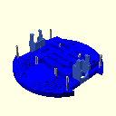
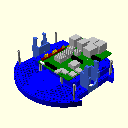
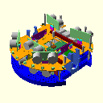
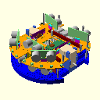
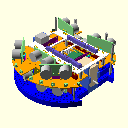

<!--
MIT License

Copyright 2020 Home Brew Robotics Club

Permission is hereby granted, free of charge, to any person obtaining a copy of this
software and associated documentation files (the "Software"), to deal in the Software
without restriction, including without limitation the rights to use, copy, modify,
merge, publish, distribute, sublicense, and/or sell copies of the Software, and to
permit persons to whom the Software is furnished to do so, subject to the following
conditions:

The above copyright notice and this permission notice shall be included in all copies
or substantial portions of the Software.

THE SOFTWARE IS PROVIDED "AS IS", WITHOUT WARRANTY OF ANY KIND, EXPRESS OR IMPLIED,
INCLUDING BUT NOT LIMITED TO THE WARRANTIES OF MERCHANTABILITY, FITNESS FOR A PARTICULAR
PURPOSE AND NONINFRINGEMENT. IN NO EVENT SHALL THE AUTHORS OR COPYRIGHT HOLDERS BE LIABLE
FOR ANY CLAIM, DAMAGES OR OTHER LIABILITY, WHETHER IN AN ACTION OF CONTRACT, TORT OR
OTHERWISE, ARISING FROM, OUT OF OR IN CONNECTION WITH THE SOFTWARE OR THE USE OR OTHER
DEALINGS IN THE SOFTWARE.
-->

# HBRC ROS Robot Mechanical Issues

The "nominal" base for the HR2 is the
[Pololu Romi Chasis](https://www.pololu.com/category/202/romi-chassis-and-accessories).
However, other bases can be considered.

## Software Installation

Do the following:

     cd .../hbrc_ros_robot_platform/mechanical  # Move to the `mechanical` directory.
     ./install_me.sh  # Run the reentrant installation script; prompts for root password
     workon hr2  # Enable the `hr2` python virtual environment.

To build everything and view it:

     make
     openscad hr2_models.scad -D 'name="hr2_arm_assembly"'

## Mechanical Requirements:

The section below is a wish list of mechanical "requirements" for the HR2.
Not all of these requirements are expected to be met.

### Base Requirements

The base requirements are:

* Use a COTS (Commercial Off The Shelf) platform.
* Differential Drive with a relatively large wheel diameter.
  * A maximum forward speed of 30cm/sec.  10 cm/sec. is acceptable.
* Over 1000 ticks per revolution odometry.
* Front and rear ball castors with low rolling friction.
  * One of the ball castors must be "floating" to deal with uneven floors.
* Runs off of rechargeable batteries.  A USB battery pack would be ideal.
  * The mass of the batteries must be along the robot center-line to
    prevent the robot from veering to one side.
  * The mass of the batteries must be towards the rear non-floating ball
    castor.
  * It would be nice if the battery pack could be easily swapped out.

### Sensor Requirements

The sensor goals are:

* Bottom reflectance sensors for edge detection and/or line detection.
  Pololu QTR/QTRX/QTRLX sensors are acceptable.
* Time of flight edge sensors.  SparcFun SEN-12787 will work.
* Sonars: SR04's sensors from China are inexpensive (and not of the
  highest quality).  5 Sonars in front and back with 22.5 degree angular spacing
  and 4 in the rear.  The sonars can be alternated to mounted on top and on bottom
  of the same PCB to save space.  There is an mechanical interference issue with
  the forward sonar and the arm.
* Bump Sensor: An inexpensive front and rear bump sensor is desired.
  It can be extremely simple.
* E-Stop Button: It is nice to have an E-stop button that is readily
  available, when the robot code goes bad.  The E-stop would disable
  the motor drivers.
* Lidar: An optional inexpensive 360 degree Lidar is very desirable.
  ComputerShop sells a bunch -- YLIDAR X4 ($99), YLIDAR G2 ($159),
  YLIDAR X2 ($69), RPLidar A1Mi ($99).
* Cameras:
  * It would be nice to have an optional forward facing camera
    for object detection, etc.
  * It would be nice to have an optional upward facing camera
    for fiducial navigation.
  * It may be possible use one camera and a servo to be able to
    do both.
* Microphone: It would be nice to be able to talk to the robot.
  * A directional microphone would be cool so that the robot can
    turn towards a speaker.
* Speaker: It would be nice if the robot could talk back.

### Actuator Requirements:
	
The actuator goals are:

* Gripper Arm: An optional arm with gripper is desirable:
  * The Pololu Romi Arm is acceptable.  It is not required to mount it
    on the Pololu expansion plate; it can be mounted forward.  Managing
    center of mass is important.
  * Non-Gripper Arms: It would be fun if there is a "arm" on each side so
    that the robot can wave its "arms".  There are no grippers on these
    side arms.  This goal is not looking too good right now.

### Indicator Requirements:

The indicator requirements are:

* LED's:
  * Front LEDS:
    * For debugging and fun there needs to be a line of LED's
      in the front.  Being able to do a Knight Rider LED sweep would be fun.
  * Rear LEDS:
    * It would be nice to have both Rear LED's that can glow read for
      braking and white for reverse (i.e. back up lights.)
* LCD: An optional LCD would be nice.
  * Ideally, this can be connected to the SBC as an output device.
  * If placed immediately below the 3D camera it can be programmed
    to be a mouth that can smile,  frown, smirk, etc.
  * If a standard size is selected, it can play video clips. (Woo Hoo!)
    
### Miscellaneous Requirements:	

The miscellaneous requirements are:

* Miscellaneous:
  * Docking Station:
    * An optional docking station would be nice.  It can be *VERY* simple.
  * USB devices:
    * Keyboard/Mouse: For debugging, a keyboard and mouse is desirable.
      * Wireless keyboard and mouse is OK.
    * Game Controller:
      * Wireless remote controller is used to drive the robot around.
  * Carrying Handle: It would be very nice to be able to pick up the
    robot with a handle.
  * Carrying Case: Strictly optional, but being able to cart the robot
    around in some sort of clear case would be nice.
  * Mount points:
    * It would be nice to provide some mount points for other expansions
      modules like Seeedstudio Grove.  This is basically a 10mm x 10mm
      grid of holes.  These can be both internal and/or external.  There
      needs to be cable access holes for externally mounted modules.

### Robot Skin requirements:

The robot skin requirements are:

* A skin is optional, but very desirable.
* Humans like anthropomorphic robots because they are more "fun".
* Having a clear skin so people can see inside is very desirable.
  * Being able to print a paper skin would be neath.

### Non-requirements:

The explicit non-requirements are:

* This platform is not expected to be operated over uneven floors.
  Even going over door strips is *NOT* required.g

## Decisions Made so far:

The current (tentative) design decisions are:

* It looks like it is possible to support multiple different SBC's (Single Board Computers)
  as long as they are basically compatible with the Raspberry Pi mounting holes and 2x20
  male connector (i.e. RPi B+, 3A+, 3B+, and 4B.)  It is possible to take a Raspberry Pi
  compatible board that is quite a bit larger than the typical Raspberry Pie and make it
  fit.  The key to accomplishing this task was to abandon the standard Pololu shaft encoder
  PCB's in favor of one that is wider along the Y axis, but shorter in the Z axis.  Given
  how trivial the encoder PCB is, this is a workable solution. This allows one edge of the
  RPi compatible SBC to extend underneath one of the drive motors.

* The ST Microelectronics Nucleo-144 development boards have been selected as the basic
  microcontroller of the robot.  These are extremely popular development boards that STM
  tends to keep in stock across multiple vendors.  A few weeks ago, the entry level board
  was at about $15, but there seems to be a run going on so the prices have crept up.
  The reasons for selection this board are:
  
  * STM got beat up over and over again about moving peripherals around on their chips.
    Eventually they figured out that they had to keep all of the peripherals mapped
    to the same pins.  This does not mean that all chips support all peripherals, but
    instead if the peripheral is present on a chip, it is available exactly the same pins
    as every other pin on other boards that has the same peripheral.  As a result of
    this design decision, all of the Nucleo144 products use the exact same PCB with
    the only difference being the CPU chip and a label that specifies which CPU chip
    is mounted.  That's it.  One nice feature of this strategy is that as newer chips
    are released, they just ship a new Nucleo144 board with the new chip.  The new board
    should be pin-for-pin compatible with the older boards.  Hopefully, the Nucelo-144
    will be "future proof".

  * The larger Nucleo-144 boards like the STM32F676ZI has 2MB of flash memory that
    should be more that adequate for running MicroPython and Micro ROS.

  * The Nucleo-144 boards come with a small attached ST-Link debugger for software
    development.  For space reasons, this board has to be cut off and remounted
    elsewhere on the master board.  This *should* support software development
    using popular IDE's (Integrated Development Environments) such as vscode and
    Eclipse in conjunction with OpenOCD.

  * The Nucleo-144 boards come with an RJ-45 connector for connecting Ethernet
    to the SBC to allow high speed communication between the two devices.

  * The Arduino IDE with the boards manager *may* allow development on the smaller
    Nucleo-144 board such as Nucleo144-F476RG.  Presumably other larger boards can
    be added as needed.

* FPGA Strategy.  The current strategy is that any FPGA's will be adapted to the
  robot through the NUCLEO-144 ZIO connectors.

## Viewing the Models:

* Run `openscad` and run "[Design]=>[Preview]":

  There is one `hr2_models.scad` file from which all of the various
  models are derived.  To select a particular model to show use the
  OpenSCAD `-D` option as follows:

            openscad hr2_models.scad -D 'name="NAME"'

  where NAME is one of:
  <!-- NAME list starts here. -->

  * `center_board`:
    Center Board

  * `center_pcb`:
    Center PCB

  * `encoder_board`:
    Encoder Board

  * `encoder_pcb`:
    Encoder PCB

  * `expansion_flat`:
    Flat Romi Expansion Plate

  * `expansion_plate`:
    Romi Expansion Plate

  * `hr2_arm_assembly`:
    Romi Base with Arm

  * `hr2_base_assembly`:
    HR2 Base Assembly

  * `hr2_master_assembly`:
    HR2 Base Assembly

  * `hr2_nucleo_assembly`:
    HR2 Nucleo144 Assembly

  * `hr2_pi_assembly`:
    HR2 Base Assembly

  * `hr2_wheel_assembly`:
    HR2 Wheel Assembly

  * `master_board`:
    Master Board

  * `master_board`:
    Master Board

  * `master_pcb`:
    Master PCB

  * `master_pcb`:
    Master PCB

  * `ne_board`:
    NE Board

  * `ne_pcb`:
    NE PCB

  * `nucleo144`:
    Nucleo144 Board

  * `nucleo144x_board`:
    NUCLEO144X Board

  * `nucleo144x_pcb`:
    NUCLEO144X PCB

  * `nw_board`:
    NW Board

  * `nw_pcb`:
    NW PCB

  * `other_pi`:
    OtherPI SBC

  * `other_pi_pcb`:
    Other Pi PCB

  * `raspi3b_board`:
    RasPi3B Board

  * `raspi3b_pcb`:
    RasPi3B PCB

  * `romi_base`:
    Romi Base Polygon

  * `se_board`:
    SE Board

  * `se_pcb`:
    SE PCB

  * `sonar`:
    HC-SR04 Sonar

  * `stlink`:
    STLink

  * `stlink_pcb`:
    STLInk PCB

  * `sw_board`:
    SW Board

  * `sw_pcb`:
    SW PCB

  * `wheel_assembly`:
    Wheel Assembly

  <!-- NAME list ends here. -->
  After you run `openscad`, use your mouse to select `[Design]`=>`[Preveiw]` and `openscad`
  will show the resulting model.

## Documentation:

### Remote Documentation

  * [Pololu Romi Chasis User's Guide](https://www.pololu.com/docs/0J68/all):
    The Pololu Romi is mostly documented by the Pololu web site.  Alas, there
    is no `.pdf` version of the file, so if Pololu ever decides to take the
    User's Guide down, it will be *GONE*.

### PNG Files
  
The `mechanical/png` directory is where various `.png` image files are stored.

The robot is assembled in the following order:

  1. [`mechancal/png/hr2_base_assembly.png`](png/hr2_base_assembly.png):
     Start with the Romi Chassis base, add *empty* motor holders and spacers
     to mount the "Pi" board and Master board on:
      
     

  2. [`mechancal/png/hr2_pi_assembly.png`](png/hr2_pi_assembly.png):
     Mount the Raspberry Pi compatible SBC (Single Board Computer)
     on the 4 spacers.  Since robots vibrate, it is recommended that every
     screw have a lock washer.
      
     

  3. [`mechancal/png/hr2_master_assembly.png`](png/hr2_master_assembly.png):
     First mount the appropriate spacers on a master board (please use lock washers.)
     Also, there is a vertical alignment screw that needs to stick straight up.
     It is M2.5 and needs to be attached with a lock washer and a hex nut.
     Do not forget this screw, because it is really easy to plug the Nucleo144
     board in offset by one or more pins otherwise.  Improperly installing the
     the Nucleo144 can destroy it.  Next mount the master board onto the robot.
     The connector on the bottom of the board will plug into the 2x20 connector
     on the Pi compatible SBC.  Finally, screw in the screws that mount the master
     board to the appropriate spacers (use lock washers!)  Note: the female receptacles
     are frequently shown in "debug" mode so that notches of material are taken out the
     the sides so that it is possible to see how deep the mating male pins go into
     the receptacle.
      
     

  4. [`mechancal/png/hr2_wheel_assembly.png`](png/hr2_wheel_assembly.png):
     Now assemble the two motor/encoder/magnet/wheel sub-assemblies.  The motor
     sub-assemblies are interchangeable; there is no left vs. right.  They
     are held in place by the plastic motor holder clips.
      
     

  5. [`mechancal/png/hr2_nucleo_assembly.png`](png/hr2_nucleo_assembly.png):
     Next, make sure that the veritcal alignment screw is still mounted
     sicking up.  If you did not install it back in step 3, go back to
     step 3 and install it.  It is really trivial to incorrectly install and
     destroy the Nucleo144 without the alignment screw.  Mount the Nucleo144
     onto the master board and screw it onto the 4 spacers (with lock washers.)
     Note that the Nucleo144 is frequently shown in debug mode with the center
     cut away to improve visiblity down to the mater board.
      
     
  
That is it for now.

### DXF Files

  There are two generated `.dxf` files available:

  * [mechanical/dxf/expansion.dxf](dxf/expansion.dxf):
    The generated `.dxf` file from the OpenSCAD model
    for the Romi Expansion Chassis.

  * [mechanical/dxf/romi_base.dxf](dxf/romi_base.dxf):
    The generated `.dxf` file from the OpenSCAD model
    for the Rom Chassis Base.

  In addition, there is are two `.dxf` files supplied by Pololu
  that are archived in the `mechanical/dxf` directory.  These
  are copyrighted by Pololu and if Pololu objects to these being
  cached in this repository, they will be removed immediately
  upon a request from Pololu:

  * [mechanical/dxf/romi_chassis.dxf](dxf/romi_chassis.dxf):
    The `.dxf` that can be used to extract the various hole,
    slot and rectangles on the Romi chassis.

  * [mechanical/dxf/romi-chassis-expansion-plate.dxf](dxf/romi-chassis-expansion-plate.dxf):
    The `.dxf` that can be used to extract the various hole,
    slot and rectangles on the Romi expansition plate.
    
### PDF Files

  There are two cached `.pdf` files from Pololu.  Again these
  are copyrighted by Pololua nd if Pololu objects to these being
  cached in this repository, they will be removed immediately
  upon a request from Pololu:

  * [mechanical/pdf/romi-chasis-expansion-plate-dimensions.pdf](pdf/romi-chasis-expansion-plate-dimensions.pdf):
    The `.pdf` that contains many (but by no means all) of then
    dimensions of the Romi Chasis Expansion Plate.

  * [mechanical/pdf/romi-chasis-expansion-plate-hole_alignment.pdf](pdf/romi-chasis-expansion-plate-hole_alignment.pdf):
    The `.pdf` that contains information about which holes line up
    between the expansion plate the the main chasis plate.

## Models:

The models are store in some Python files, which upon execution generate
the associated OpenSCAD files.  There are two directories:

### `scad_models`

The `scad_models` directory currently contains:

* `scad.py`: This is a library of Python code that is used to generate
  an OpenSCAD `.scad` file.

* `hr2_models.py`: This is the Python code that builds all of the
  OpensCAD models using the `scad.py` liberary.

* `__init__.py`: This is the file that is required by Pythong to indicated
  that the `scad_models` directory contains a Python package.

The program `pydoc NAME.py` will print out the Python doc strings for some
Documentation.

### `tests`

The `tests` directory currently contains the Python Unit tests:

* `test_scad.py`: The unit tests for the `scad.py` library.

* `test_hr2_models.py`: A unit tests for the `scad_models.py` code.

## Miscellaneious:

There a a bunch of miscellaneous files in the `mechanical` directory:

* `README.md`: This documetation file.

* `setup.py`: This file is required by Python to construct the `scad_models`
  package.

* `develop.rec`: This is a list of Python packages that are used by this project.

* `Makefile`: There is a `Makefile` that is used to build everthing.
  It has the following three targets:

* `clean`: Removes all derived files to force a clean build.

* `all`: Build everything.  This involves:

  * Running the Python files through `mypy`, `flake8`, and `pydocstyle`.
  * Installing the `scad_modules` package in the Python virtual environment.
  * Runs the `hr2_models.py` program from the Python virtual environment to
    generate `hr2_models.scad`.
  * Generates various `.dxf` and `.png` files.

* `test`: Runs the Python unit test suites and outputs any code lines
   that is not covered by the test suites.

* [romi_base.csv](romi_base.csv): This is a `.csv` (Comma Separated Value) file that
  can be read in as a spreadsheet.  It identifies pretty much all of
  the holes, slot, and rectangles on the Romi Chasis with the origin
  set to the exact middle of the chassis.

* [romi_base.html](romi_base.html): This contains the same content as the `romi_base.csv`
  file, but in HTML table format.  It is easier to read in a web browser.
