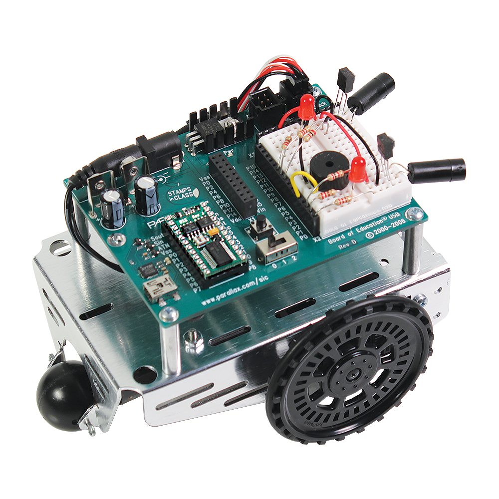

# Introduction to H2 Project

Speaker: Wayne Gramlich
Date: April 29, 2020
Time: 7:00PM PDT
Location: Zoom Video Chat

## Abstract

xxx

## Some HBRC History

* HBRC Founded 1984 by Dick Prather (meets at Alza).
* Early 90's: HBRC moribund (no meeting place).
* Late 90's: HBRC revived (Cupertino Library) w/Chuck@President
* During the early 2000's, moved to Castro Middle School.
* In 2002, HBRC started its Table Top Challenges.
* HBRC => CMU campus (w/Wayne@President)
* HBRC => Google (w/Osman@President)
* HBRC =>Web (Coronavirus) (w/Chris@President)

## The BOEBot Purchase

* Early 2000's:
* Club purchase 10+ Parallax BOE-Bots.
* 
* Basic Stamp!
* A bunch used in early Table Top Challenges.

## Not much changed in 20 years

* 2 Motors + Castor + Encoders
* Pathetic processor (Basic Stamp, Arduino, etc.)
* Most members wound up building their own.

## Problems with Custom Robot Platforms

* No commonality.
* No hardware & software sharing.
* Reliability tends to suffer.

## 2019 FPGA Class

* Polulu Romi Robot (wheels/castor/motors/encoder/H-Bridge)
* Custom PCB for FPGA/Sonars/LED's/Edge sensors
* Group build!
* *EVERYTHING* Ran on Raspberry Pi 3B+
* Networking at Hacker Dojo was challenging

## HR2: An Idea Is Born...

* [H]BRC [R]OS [R]obot => HRR => HR2
* Keep the [Romi](https://www.youtube.com/watch?v=5Mrd0w9fmKo) Platform
  * URL: https://www.youtube.com/watch?v=5Mrd0w9fmKo
* Support the Romi Arm
* Redo the custom PCB
  * Keep Raspberry Pi
  * Use a non-pathetic microcontroller
  * Continue to support FPGA's
* Add ROS1 & ROS2 support

## Some Decisions Get Made

* 100% Open Architecture
* Use a daughter board architecture
  * Use [STM Nucleo-144 Dev. Boards](../../electrical/docs/stm32_nucleo_144_manual.pdf)
  * FPGA's plug on top of Nucleo
  * More expansion (Grove/MikroBus/etc.)
* Support more than Raspberry Pi SBC

## Mechanical Issues

* Romi is neither big nor strong!
* Not much room for a Raspberry Pi.
* Encoders really get in the way.
* Lot's of mounting holes (good/bad).
* Arm keeps getting higher off ground.
* Small motors => weight constraints.

## Mechanical Design Process

* `scad.py` library for `.scad` generation (3.5K lines)
* QCad to Extract hole locataions (qcad)
* `scad_models.py` generates `.scad` file (14.5K lines)
* OpenScad to view models, generate images/dxf files

## Mechancial Stackup:

* Qcad (show qcad)
* Base (show hr2_base)
* +Pi (show hr2_pi)
* +PCB (show hr2_master)
* +Motors/Encoders (hr2_wheel)
* +Nucleo (show hr2_nucleo)
* +Arm (show hr2_arm)

## Micro-Controller Selection

* Availabilty really matters
* AVR/MIPS/ARM/Other? Arm Cortex M
* MPU placement On/Off PCB? Use Dev. Board
* Cypress/Infineon/Maxim/MicroChip/NXP/ST/TI/Toshiba? STM
* Nucleo-32/64/144? 144
* Board too big? yes. Cut off ST-link and remount

## PCB Development

* Still in Early stages
* KiCAD (show kicad)
* STM32Cube (show )
* KiPart
* Rev. A: [Bantam Tools PCB Mill](https://www.bantamtools.com/)
  * Rectangular board
* Rev. B: Shipped out to PCBA house
  * Round'ish board.

## Expansion

* FPGA Boards (TBD)
* [Arduino Shields](http://shieldlist.org/)
* [Seeedstudio Grove](https://www.seeedstudio.com/grove.html)
* [mickroBUS](https://www.mikroe.com/mikrobus)
* Serial Bus (TBD)

## Software Issues:

* Limited progress so far:
* Install script (`hr2_install`) largely done
* Use `stm32cubeide` (Eclipse + STM stuff)
* ROS1/ROS2 not started.
* No drivers written yet

## Conclusions

* Work in progress
* 3-6 months
* Open to amateur robotics community
